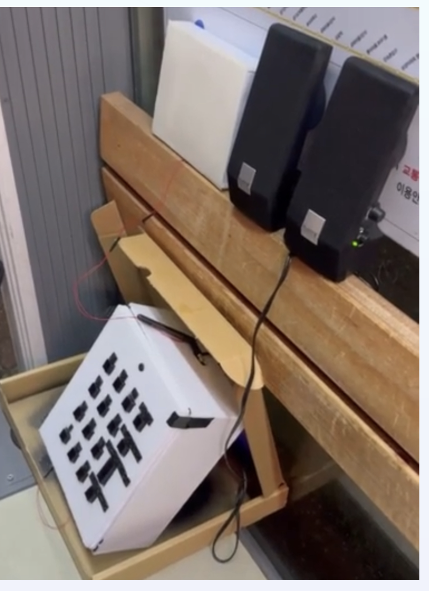
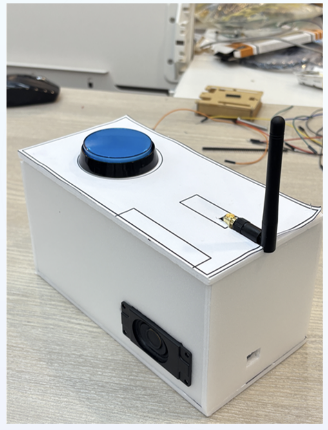
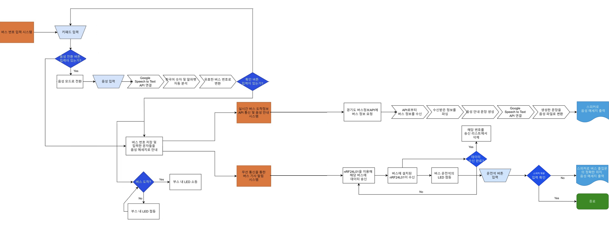
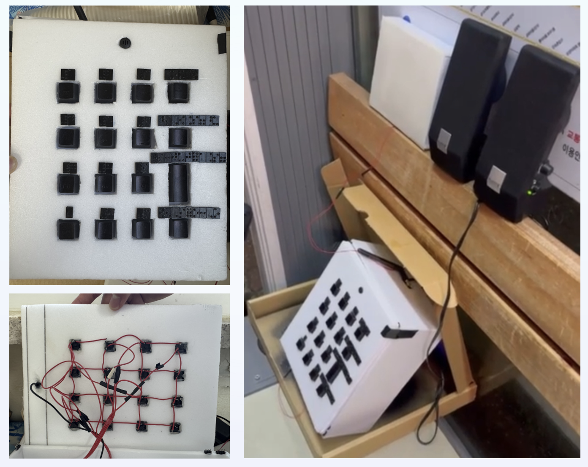
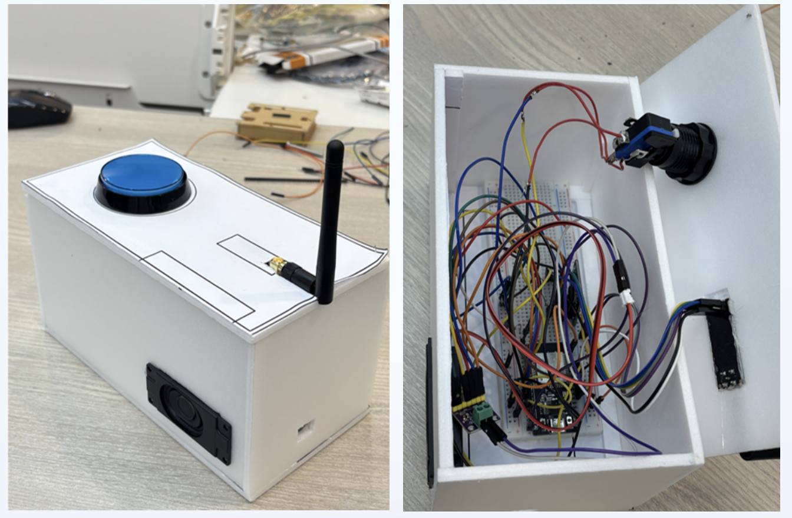
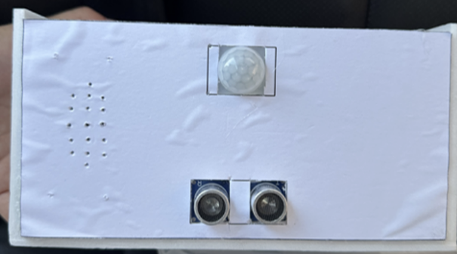
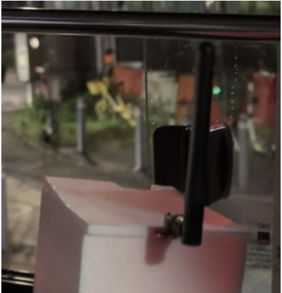
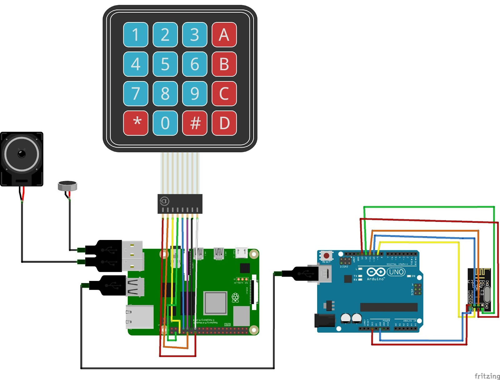
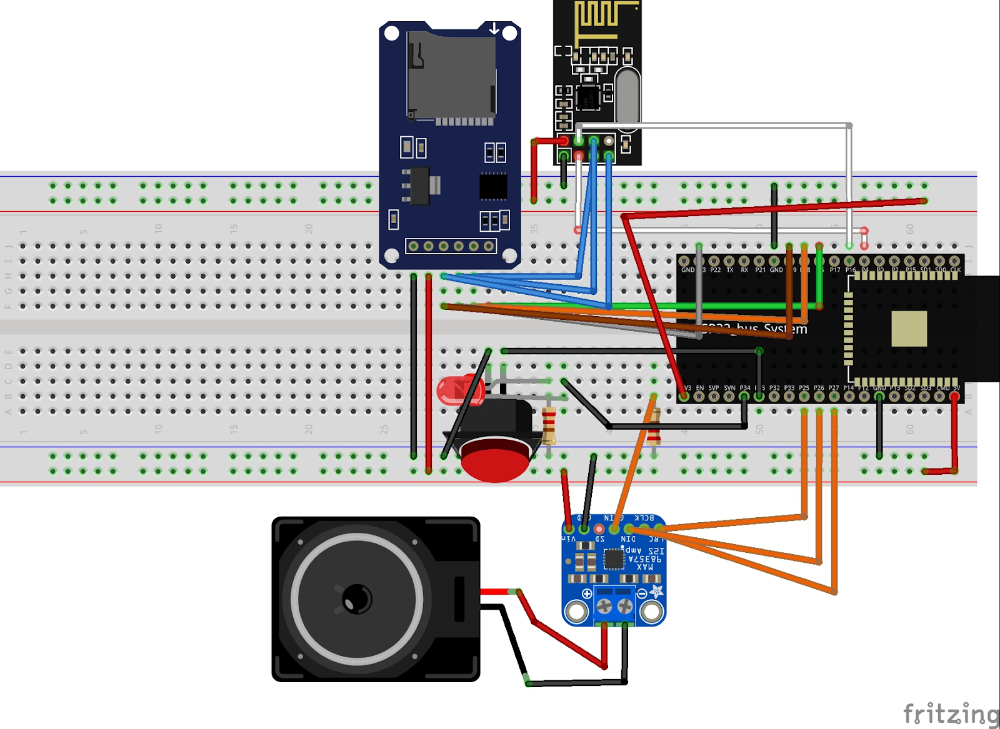

# 시각장애인을 위한 스마트 버스 정류장 시스템

시각장애인이 **음성 또는 점자 키패드**로 버스 번호를 입력하면 실시간 도착 정보를 음성으로 안내하고, 무선 통신으로 버스 기사에게 탑승 의사를 전달하는 IoT 시스템

<p align="center">
  
  &nbsp;
  
  <br>
  <sub>좌: 정류장 부스 — 점자 키패드 + USB 스피커 &nbsp;|&nbsp; 우: 버스 내 수신 장치 완성품 (ESP32 + nRF24L01)</sub>
</p>


---

## 프로젝트 배경

시각장애인은 버스 번호판을 읽거나 도착 시간을 확인하기 어려워 대중교통 이용에 큰 불편을 겪는다. 기존 점자 블록과 음성 안내 단말은 버스 기사에게 탑승 의사를 전달하는 기능이 없어, 버스가 그대로 지나치는 상황이 빈번하다. 또한, 여러 대의 버스가 동시에 버스정류장에 진입할 경우, 어느 버스를 타야할 지 판단하기 어렵다.

저비용 임베디드 시스템으로 **음성 인식 + 실시간 도착 조회 + 무선 탑승 신호 전송**을 하나의 정류장 부스에 통합해, 시각장애인이 독립적으로 버스를 이용할 수 있는 실증 시스템 구현하였다.

---

## 시스템 구조

<p align="center">
  
  <br>
  <sub>전체 시스템 구조도</sub>
</p>

```
[정류장 부스]
  PIR 센서 / 초음파 센서 → 접근 감지 → 음성 안내

  점자 키패드 ──→                    ┌─ 경기도 버스도착정보 API
  USB 마이크  ──→ Raspberry Pi 4 ───┤
                  (Google Cloud STT) └─ TTS 음성 안내 (USB 스피커)
                        │
                        │ Serial (USB)
                        ▼
                  Arduino Uno ──[nRF24L01 무선]──→ ESP32 (버스 내)
                  LCD 상태 표시                    LED 점등 + 음성 안내
```

---

## 본인 기여

6인 팀 프로젝트에서 **Raspberry Pi 4 기반 소프트웨어를 전담**. 음성 인식부터 버스 API 조회, TTS, 파이프라인 통합까지 RPi4 측 전체 소프트웨어를 설계하고 구현

### 음성 인식 (`speech_to_text_rpi.py`)

PyAudio로 USB 마이크 오디오를 캡처하고 Google Cloud Speech-to-Text API로 한국어 음성 인식.  
인식된 텍스트에서 버스 번호를 추출할 때, 한국어 수사("오", "일", "이")를 숫자로 변환하고 영문 알파벳 발음("엠", "에이" 등)도 처리하는 파싱 로직을 직접 구현.  
번호 인식 후 "X번 버스 맞으신가요?" 확인 응답까지 처리.

### 음성 합성 (`text_to_speech_rpi.py`)

gTTS로 한국어 TTS 음성 파일 생성, `aplay -l` 출력을 파싱해 키워드 기반으로 USB 스피커를 자동 탐색한 뒤 ALSA 장치명을 동적으로 지정해 mpg123으로 재생.  
스피커가 바뀌어도 코드 수정 없이 자동으로 올바른 장치에 출력.

### 실시간 버스 도착 조회 (`fetch_and_speak.py`)

경기도 공공 버스도착정보 API(v2)에 등록된 버스 번호를 조회하고, 도착 예정 시간과 남은 정류장 수를 파싱해 TTS로 음성 출력. 복수 노선을 순차 조회해 "X번 버스는 N분 후 도착 예정이며, Y번 버스는..." 형태로 이어서 안내.

### 통합 파이프라인 (`run_pipeline.sh`)

음성 인식 → 버스 번호 추출 → Arduino 시리얼 송신 → API 조회 → TTS 안내로 이어지는 전체 흐름을 Bash 스크립트로 통합.  
Python 프로세스의 stdout에서 `CONFIRMED_BUS:` 접두사로 버스 번호를 파싱해 시리얼 포트로 직접 전송.

### 키패드 메인 루프 (`KEYPAD.py`)

RPi.GPIO로 4×4 매트릭스 키패드를 폴링 방식으로 읽고 디바운싱 처리. Arduino로부터 `ARRIVED:번호` 시리얼 응답을 수신하면 대기 목록에서 해당 버스를 자동 제거하고 LED 상태 업데이트.

---

## 기술적 문제 해결

### 프로세서별 역할 분리 — 제약 분석 기반 아키텍처 결정

초기에는 ESP32 단독으로 음성 입력과 Google STT 전송까지 처리하려 했으나, 최대 2초 분량의 음성 버퍼와 `.wav` base64 인코딩 전송 과정에서 SRAM 한계에 봉착. 여기에 마이크(INMP441)와 앰프(MAX98357A)가 단일 I2S 페리페럴을 공유해 동시 사용이 불가능한 제약도 존재.

각 연산의 성격에 맞춰 프로세서 역할을 분리하는 방향으로 재설계. 연산과 네트워크 부하가 큰 음성 인식, TTS, 버스 API 조회는 Raspberry Pi 4가 담당하고 USB 오디오를 써서 I2S 리소스 경합 자체를 회피. 반대로 타이밍이 민감한 nRF24L01 무선 송신은 RPi의 유저스페이스 SPI로는 지연이 불규칙해 실패율이 높았기 때문에, 실시간성이 보장되는 Arduino Uno가 전담하고 RPi와는 시리얼로 결합. 결과적으로 각 프로세서가 강점을 갖는 역할만 맡는 구조로 안정성 확보.

### SPI 버스 경합 디버깅 — nRF24L01과 SD카드

수신단 ESP32에서 nRF24L01과 SD카드 모듈을 동일한 SPI 버스에 연결하면 한쪽만 인식되는 문제 발생. 원인을 추적한 결과, SD카드 모듈이 비선택(CS 비활성) 상태에서도 MISO 라인을 하이 임피던스로 완전히 놓지 않아 버스를 계속 점유하는 것이 원인.

SD카드 MISO 라인에 1kΩ 직렬 저항을 삽입해 nRF24L01 MISO와 병렬로 연결, 저항이 SD 측의 잔류 구동을 흡수해 두 디바이스가 버스를 정상적으로 공유하도록 해소.

---

## 하드웨어 사진

<p align="center">
  
  &nbsp;
  
  <br>
  <sub>좌: 점자 키패드 제작 과정 + 부스 설치 현장 &nbsp;|&nbsp; 우: 버스 내 수신 장치 외관 및 내부 배선</sub>
</p>

<p align="center">
  
  &nbsp;&nbsp;
  
  <br>
  <sub>좌: 정류장 부스 외관 (PIR + 초음파 센서 패널) &nbsp;|&nbsp; 우: 실제 버스 내 설치 현장</sub>
</p>

<p align="center">
  
  &nbsp;
  
  <br>
  <sub>좌: 정류장 측 배선 구성 (RPi4 + 키패드 + Arduino Uno + nRF24L01 + 스피커) &nbsp;|&nbsp; 우: 버스 내 수신 장치 배선 구성 (ESP32 + nRF24L01 + 스피커 + LED)</sub>
</p>

---

## 기술 스택

| 분류 | 사용 기술 |
|:---|:---|
| 음성 인식 | Google Cloud Speech-to-Text API, PyAudio |
| 음성 합성 | gTTS, mpg123, ALSA |
| 버스 정보 | 경기도 공공데이터 버스도착정보 API v2 |
| 임베디드 | Raspberry Pi 4 (RPi.GPIO, pyserial), Arduino Uno, ESP32 |
| 무선 통신 | nRF24L01 (RF24 라이브러리) |

---

## 소스 코드 구조

```
├── rpi/                           # Raspberry Pi 4 소프트웨어
│   ├── KEYPAD.py                  # 키패드 입력 처리 및 메인 루프
│   ├── speech_to_text_rpi.py      # 음성 인식 (Google Cloud STT)
│   ├── text_to_speech_rpi.py      # 음성 합성 (gTTS + ALSA)
│   ├── fetch_and_speak.py         # 버스 도착 API 조회 및 TTS 출력
│   ├── run_pipeline.sh            # 음성 입력 → 조회 → 시리얼 송신 파이프라인
│   └── requirements.txt           # Python 패키지 목록
├── transmitter/
│   └── transmitter.ino            # Arduino Uno: nRF24L01 송신, LCD 표시
└── bus_receiver_5100/
    └── bus_receiver_5100.ino      # ESP32: nRF24L01 수신, MP3 재생, LED 제어
```

---

## 실행 방법

```bash
pip install -r rpi/requirements.txt
```

`rpi/speech_to_text_rpi.py`의 `KEY_FILE_PATH`를 Google Cloud 서비스 계정 키 경로로 수정 후:

```bash
python3 rpi/KEYPAD.py                    # 키패드 모드 실행
bash rpi/run_pipeline.sh                 # 음성 파이프라인 단독 실행
python3 rpi/fetch_and_speak.py 5100      # 특정 버스 즉시 조회
```

Arduino IDE에서 `transmitter.ino`, `bus_receiver_5100.ino`를 각 보드에 업로드.  
필요 라이브러리: `RF24`, `LiquidCrystal_I2C`, `ESP32-audioI2S`

---

## 데모

**시연 영상**: [`docs/demo.mp4`](docs/demo.mp4)

---
